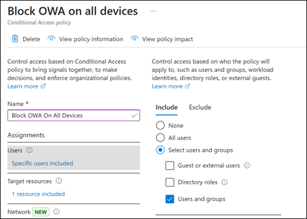

# How to enable the new Outlook for Windows if Outlook for Web is blocked 

Admins can use the [OwaEnabled CASMailbox]([url](https://learn.microsoft.com/en-us/powershell/module/exchange/set-casmailbox?view=exchange-ps#example-1)) policy to prevent users within their organization from accessing Outlook for web, but this can impact many of the features in new Outlook for Windows. To prevent users from accessing Outlook for web while allowing access to the new Outlook for Windows, admins should use Conditional Access policies. This approach will not impact users' access to the new Outlook for Windows.  

**Details on the OwaEnabled CASMailbox Policy **

The OWAEnabled parameter enables or disables access to the mailbox using Outlook on the web and the new Outlook for Windows. Valid values are: 

- $true: Users can open their mailboxes in Outlook on the web and new Outlook for Windows (assuming there aren't other policies that block access to new Outlook for Windows). This value is the default.
- $false: Users can't open their mailboxes in Outlook on the web or new Outlook for Windows. Other settings that apply to Outlook on the web or new Outlook for Windows in the **Set-CasMailbox** cmdlet are ignored.

For more information, see [Enable or disable Outlook on the web for a mailbox in Exchange Online]([url](https://learn.microsoft.com/en-us/Exchange/recipients-in-exchange-online/manage-user-mailboxes/managing-email-apps-for-user-mailboxes)), or [Enable or disable Outlook on the web access to mailboxes in Exchange Server.]([url](https://learn.microsoft.com/en-us/exchange/clients/outlook-on-the-web/mailbox-access)) 

## Use Conditional Access to block mailbox access in Outlook on the web only

> [!NOTE]
> To create Conditional Access policies, you need Microsoft Entra ID P1.
>
> This Conditional Access policy also blocks user access to Microsoft Teams in a web browser. Access using the Microsoft Teams desktop app isn't affected.

1. In the Microsoft Entra admin center, go to the **Conditional Access | Policies** page at <https://entra.microsoft.com/#view/Microsoft_AAD_ConditionalAccess/ConditionalAccessBlade/~/Policies>.
1. On the **Conditional Access | Policies** page, select **New policy**.
1. On the **New** page that opens, configure the following settings (leave all other settings at the default values):
   - **Name**: Give your policy a unique name. For example, **Block Outlook for web On All Devices**.

   - **Assignments** section:
     - **Users**: Select **0 users and groups selected**. On the **Include** tab of the flyout that opens, select one of the following values:
       - **All users**
       - **Select users and groups**: Select **Directory roles** and/or **Users and groups** to specify the users who shouldn't access their mailboxes in Outlook on the web.

       

     - **Targeted resources**: Select **No targeted resources selected**. On the **Include** tab of the flyout that opens, configure the following settings:
       1. Select **Selected resources**.
       1. In the **Select** section, select **None**.
       1. In the **Select** flyout that opens, start typing **Office 365 Exchange Online**, and then select that value from the results.
       1. Select **Select** at the bottom of the flyout.

     - **Conditions**: Select **0 conditions selected**. In the flyout that opens, configure the following options:
       - **Device platforms**: Select **Not configured**, and then configure the following settings in the **Device platforms** flyout that opens:
         - **Configure**: Slide the toggle to **Yes**.
         - **Include** tab: Leave **Any device** selected and then select **Done**.
       - **Client apps**:  Select **Not configured**, and then configure the following settings in the **Client apps** flyout that opens:
         - **Configure**: Slide the toggle to **Yes**.
         - Uncheck all settings except **Browser**. Leave **Browser** selected, and then select **Done**.

   - **Access controls** section:
     - **Grant**:  Select **0 users and groups selected**. In the **Grant** flyout that opens, select **Block access**, and then select **Select** at the bottom of the flyout.

   - **Enable policy**: Select **On**.

1. When you're finished on the **New** page, select **Create**

All users included in the **Users** tab are blocked from accessing their mailboxes in Outlook on the web within one hour of saving the policy. Access to their mailboxes in new Outlook for Windows isn't affected.

## Enable access to new Outlook for Windows

Now that you have blocked OWA using Conditional Access, you can update the OwaEnabled CASMailbox policy to $true so that users can access the new Outlook for Windows. Follow the instructions in [this article]([url](https://learn.microsoft.com/en-us/exchange/clients/outlook-on-the-web/mailbox-access#use-the-exchange-management-shell-to-enable-or-disable-outlook-on-the-web-access-to-a-mailbox)) to update the OWAEnabled CASMailbox policy using PowerShell or the Exchange Admin Center.  

To see how else you can control Outlook for Web with Conditional Access see our blog post on the topic: [Conditional Access in Outlook on the web for Exchange Online | Microsoft Community Hub ]([url](https://techcommunity.microsoft.com/blog/outlook/conditional-access-in-outlook-on-the-web-for-exchange-online/267069))

For instructions in PowerShell or the Exchange admin center (EAC), see the following articles:

- **Exchange Online**: [Enable or disable Outlook on the web for a mailbox in Exchange Online](/exchange/recipients-in-exchange-online/manage-user-mailboxes/enable-or-disable-outlook-web-app)
- **Exchange Server**: [Enable or disable Outlook on the web access to mailboxes](/exchange/clients/outlook-on-the-web/mailbox-access).
